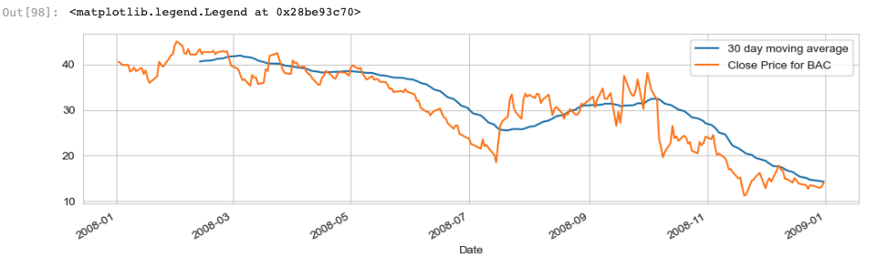

# Python-Data-Analysis

In these two capstone projects, I use real-world datasets to conduct exploratory data analysis using Python tools and libraries.

## 911 Calls Data Project:
Using a dataset of 911 call records from Kraggle, I compare the different types of emergencies as well as the date(by month & year) in order to graph the information to get a better understanding of 911 call history and trends in the dataset.

DataSet Catagories:
* lat : String variable, Latitude
* lng: String variable, Longitude
* desc: String variable, Description of the Emergency Call
* zip: String variable, Zipcode
* title: String variable, Title
* timeStamp: String variable, YYYY-MM-DD HH:MM:SS
* twp: String variable, Township
* addr: String variable, Address
* e: String variable, Dummy variable (always 1)

## Finance Project:
In this data project, I focused on exploratory data analysis of stock prices of various banks in the past decade in order to:
* Map distribution returns of the bank (analysis of stock volatility) 
* Calculate the 30-day moving average and compare it to the actual stock price using a line plot
* Create HeapMaps to determine if any correlations exists between each bank stock

## Following libraries used:
* NumPy
* Pandas
* Matplotlib
* Seaborn
* Plotly
